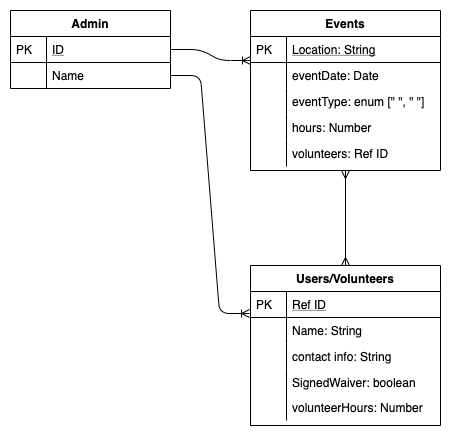
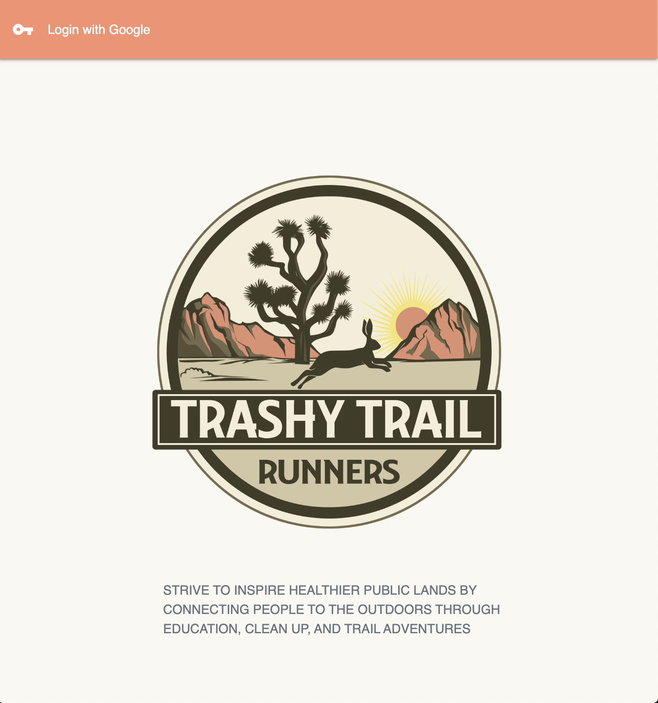
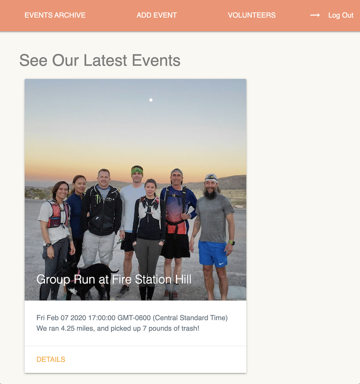
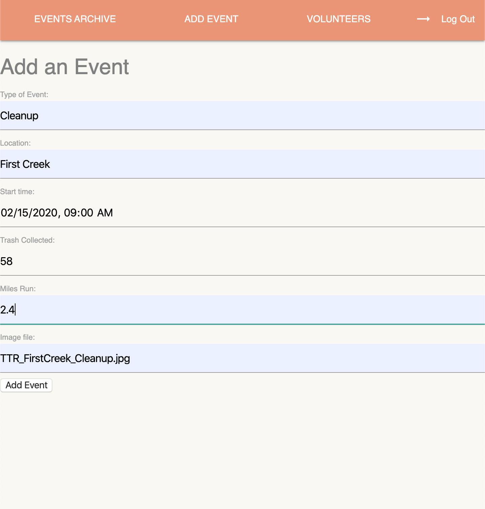

# Trashy Trail Runners

### Date: 3/6/2020

#### Developer: Brandon Carter
***

### ***Description***

##### My sister-in-law Kim is an avid trail runner who wanted to do something about all the trash she saw along the trails she was running. Along with her friend Anne, a fellow running enthusiast, she started a volunteer group to clean up thier local trails while building a stronger trail running communtity. Now that their organization is growing they need a better way to keep track of thier events and volunteers. The goal of my app is to give them a place to upload event and volunteer data more easily.
***

### ***Technologies Used***

* ##### HTML
* ##### CSS
* ##### JavaScript
* ##### Node.js/Express
* ##### MongoDB/Mongoose
* ##### Heroku
* ##### Materialize
***

### ***Getting Started***

##### After loging in with your Google account, events can be viewed. When viewing event details, the event can be updated or deleted. Volunteers can be added, viewed, updated, and deleted from the volunteers page.
***

##### This project has been deployed using Heroku and can be viewed [here](https://ga-project2-ttr.herokuapp.com/).
***

##### Trello was used during development for tracking goals and can be viewed [here](https://trello.com/b/uvBFd4uH/project-2-crud-app).
***

### ***Screenshots***

###### Entity Relationship Diagram

###### Login Page

###### Events Page

###### Add Events Page

***

### ***User Experience***

#### User Story #1
##### Our event coordinator Kim just finished a successful event and wants update the website to show all the info from that event; group pictures, how far they ran, how much trash they picked up, etc. 
#### User Story #2
##### Our volunteer coordinator Anne wants to keep track of all the volunteers info, like their accumulated hours and when their volunteer forms will expire.
#### Minimum Viable Product
* ##### As a user, I should be able to log in with my Google account.
* ##### As a user, I should be able to add an event.
* ##### As a user, I should be able to see all my past events.
* ##### As a user, I should be able to edit my events.
* ##### As a user, I should be able to delete my events.
* ##### As a user, I should be able to log in with my Google account.
* ##### As a user, I should be able to add a volunteer.
* ##### As a user, I should be able to see all volunteers.
* ##### As a user, I should be able to edit my volunteer's info.
* ##### As a user, I should be able to delete volunteers.
* ##### As a user, I should be able to add volunteers to an event.
***

### ***Upcoming Features***

-  Make app mobile friendly
-  Allow users/volunteers to create a profile
-  Allow users/volunteers to comment on events
-  Show volunteers accumulated miles and hours
-  Display the organization's accumulated miles and trash picked up
***
